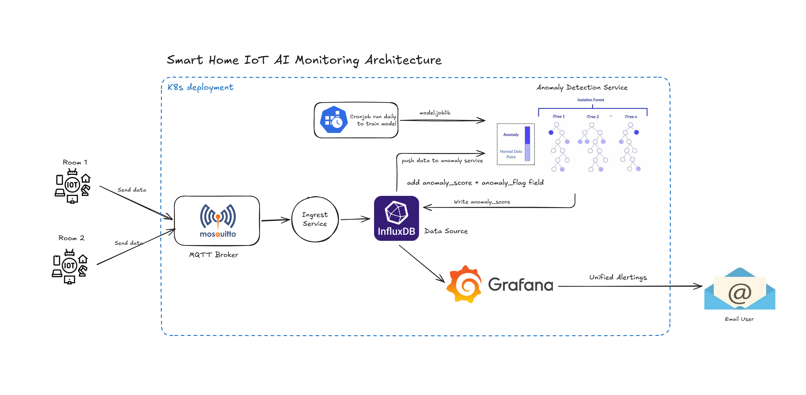
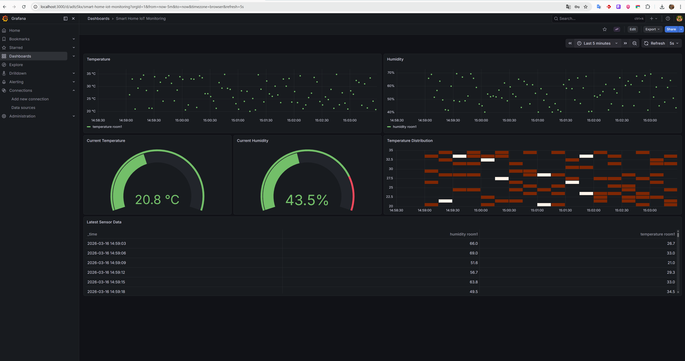

::: {align="center"}
# Smart Home IoT AI Monitoring on Kubernetes



A cloud-native IoT monitoring platform powered by **AI/ML and
Kubernetes**.

Simulates IoT sensors → streams telemetry through MQTT → stores
time-series data in InfluxDB → detects anomalies using machine learning
→ visualizes metrics in Grafana.

`<br>`{=html}


:::

------------------------------------------------------------------------

# Overview

This project demonstrates a **cloud-native IoT monitoring platform
deployed on Kubernetes with machine learning anomaly detection**.

The system simulates IoT sensors that publish telemetry through MQTT.\
Data is processed by microservices, stored in a time-series database,
analyzed using a machine learning model, and visualized in Grafana
dashboards.

The project showcases modern **cloud-native architecture** combining:

-   Kubernetes microservices
-   IoT telemetry streaming
-   Time-series data storage
-   Machine learning inference
-   Observability dashboards

Telemetry pipeline:

    IoT Simulator → MQTT Broker → Ingestion Service → InfluxDB → ML Anomaly Detection → Grafana

------------------------------------------------------------------------

# Components
  **IoT Simulator**                   Python program generating simulated
                                      sensor data

  **MQTT Broker**                     Messaging layer for IoT telemetry

  **Ingestion Service**               Consumes MQTT messages and writes
                                      metrics to InfluxDB

  **InfluxDB**                        Time-series database storing sensor
                                      telemetry

  **Anomaly Detection Service**       Machine learning service using
                                      Isolation Forest

  **Grafana**                         Visualization dashboard for
                                      telemetry and anomaly metrics
  -----------------------------------------------------------------------


# Machine Learning

The platform includes a **machine learning service that detects
anomalies in sensor data**.

The anomaly detection service uses an **Isolation Forest model** trained
on historical telemetry data.

Features used for anomaly detection:

-   temperature\
-   humidity

Workflow:

    Historical sensor data
            ↓
    Model Training
            ↓
    model.joblib
            ↓
    Anomaly Detection Service
            ↓
    anomaly_score + anomaly_flag
            ↓
    InfluxDB
            ↓
    Grafana

Example anomaly output:

    {
     temperature: 37.5,
     humidity: 82.1,
     anomaly_score: -0.41,
     anomaly: true
    }

The ML service continuously analyzes incoming telemetry and flags
abnormal sensor behavior in real time.

------------------------------------------------------------------------

# Quick Start

## 1. Clone repository

``` bash
git clone https://github.com/xcentralnn/smart-home-iot-k8s.git
cd smart-home-iot-k8s
```

------------------------------------------------------------------------

# 2. Deploy the platform

All Kubernetes manifests are managed using **Kustomize**.

``` bash
kubectl apply -k k8s/
```

Verify workloads:

``` bash
kubectl get all -n smart-home
```

Example healthy output:

    NAME                             READY   STATUS
    pod/grafana-xxxx                 1/1     Running
    pod/influxdb-xxxx                1/1     Running
    pod/ingestion-xxxx               1/1     Running
    pod/mqtt-xxxx                    1/1     Running
    pod/anomaly-detector-xxxx        1/1     Running

Services:

    service/grafana    NodePort   3000:32000
    service/influxdb   ClusterIP  8086
    service/mqtt       NodePort   1883:31883

Once all pods are **Running**, the platform is ready.

------------------------------------------------------------------------

# 3. Run the IoT simulator

Create Python environment:

``` bash
python3 -m venv .venv
source .venv/bin/activate
```

Install dependencies:

``` bash
pip install -r simulator/requirements.txt
```

Run simulator:

``` bash
python simulator/device_simulator_room1.py
```

Example output:

    Connected to MQTT broker

    Published:
    {
     temperature: 28.9,
     humidity: 46.2,
     device: room1
    }

Sensor telemetry is now streaming into the platform.

------------------------------------------------------------------------

# 4. Access Grafana

### Option 1 --- NodePort

Open in browser:

    http://localhost:32000

------------------------------------------------------------------------

### Option 2 --- Port Forward (recommended if NodePort does not work)

``` bash
kubectl port-forward svc/grafana 3000:3000 -n smart-home
```

Open:

    http://localhost:3000

------------------------------------------------------------------------

Login credentials:

    admin
    admin

------------------------------------------------------------------------

# 5. View the dashboard

After login:

    Dashboards → IoT

You will see real-time telemetry including:

-   temperature
-   humidity
-   anomaly score
-   anomaly detection events

The dashboard updates continuously as the simulator publishes new sensor
data.

------------------------------------------------------------------------

# Demo

------------------------------------------------------------------------

# Data Pipeline

    IoT Simulator
          ↓
    MQTT Broker
          ↓
    Ingestion Service
          ↓
    InfluxDB
          ↓
    ML Anomaly Detection
          ↓
    Grafana Dashboard

------------------------------------------------------------------------

# Future Improvements

Potential extensions:

-   multi-device IoT simulation\
-   autoscaling ingestion with **KEDA**\
-   GitOps deployment using **ArgoCD**\
-   CI/CD pipelines for container builds\
-   Prometheus monitoring integration\
-   ML model retraining pipeline\
-   Edge AI inference for IoT devices

------------------------------------------------------------------------

# License

MIT License
